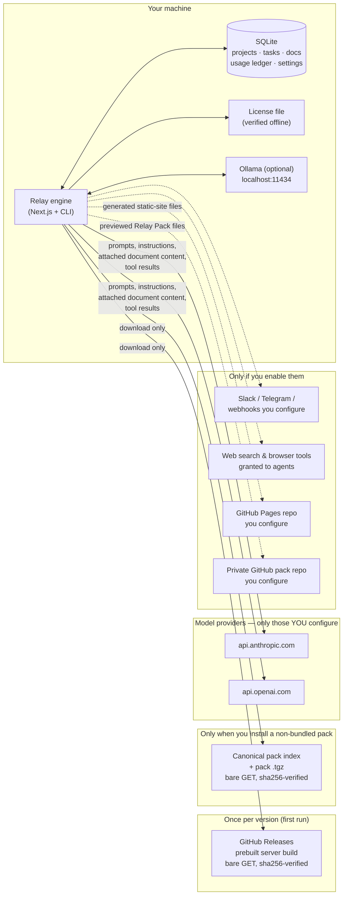

# Data flow: what leaves your machine, and when

Relay is local-first: the engine, the database, your documents, and your
license all live on your machine. But Relay orchestrates AI agents, and
agents call model APIs — so "local-first" needs a precise disclosure, not a
slogan. This page is the complete inventory of every outbound network call
the product can make, verified against the code (file references inline).

## The short version

For a plain `npx orionfold-relay` install with nothing configured, Relay
makes exactly **one** kind of outbound call: a checksum-verified download of
the production server build from GitHub Releases, once per version. Every
other egress in the product exists only downstream of something you
explicitly configure or click — including the canonical pack index, which is
read **only** when you run `relay pack add <name>` for a pack that did not
ship with your install (a bare, sha256-verified GET that sends nothing about
you; row 11), and GitHub Pages publishing, which sends generated site files
only after you create a target with your own GitHub credential and click
publish (row 12). Community pack publishing likewise sends only the exact
previewed `pack.yaml` + `base/` tree to your own repository after explicit
confirmation; live table rows remain local unless you deliberately include a
bounded sample (row 13). There is **no telemetry, no analytics, no crash reporting,
no update check, and no license activation server** anywhere in the codebase.

## Complete egress inventory

| # | Call | When | Destination | What is sent | Off switch / gate |
|---|---|---|---|---|---|
| 1 | Prebuilt server build download | First launch of each version | `github.com/orionfold/relay/releases` | Nothing — bare GET; response is sha256-verified ([`prebuilt-download.ts`](../../src/lib/desktop/prebuilt-download.ts)) | `RELAY_BUILD_ARTIFACT_URL` (mirror or `file://` for air-gap) |
| 2 | Model API calls | An agent run, chat, or scheduled workflow executes | Only providers you hold keys for: `api.anthropic.com`, `api.openai.com`, or local Ollama (`localhost:11434`) | Prompts, profile instructions, conversation history, **attached document/table content in scope**, tool results | Don't configure the key; route work to Ollama for $0-egress |
| 3 | Server-side web search | Agent runs on the OpenAI-direct runtime (**on by default** there); or `WebSearch`/`WebFetch` granted to Claude profiles | Executed provider-side (OpenAI / Anthropic) | The agent's search queries / fetched URLs | Profile tool permissions; runtime choice |
| 4 | License file fetch | You run `relay license add <url>` / `pack add --license-url` with an **http(s) URL** | The fulfilment URL you pasted | Nothing — bare GET | Pass a local file path instead; verification itself is always offline ([`load.ts`](../../src/lib/licensing/load.ts)) |
| 5 | Channel delivery | Only for channels you created with your own tokens | `api.telegram.org`, `slack.com`, or your webhook URL | The notification/message text you routed to that channel | Don't create the channel; pollers no-op with no active bidirectional channels |
| 6 | Optional agent tooling | Only if you enable the setting | Exa search MCP (`mcp.exa.ai`); browser MCP packages fetched via `npx` from the npm registry | Search queries; pages the agent browses | `EXA_SEARCH_MCP_ENABLED`, `BROWSER_MCP_*_ENABLED` (all default off) |
| 7 | GitHub imports | You click import and supply a repo URL | `api.github.com`, `raw.githubusercontent.com` | GETs for the repo you named | Don't use the import feature |
| 8 | Pricing registry refresh | You click **Refresh** in Settings → Pricing | Public pricing pages (`anthropic.com`, `openai.com`) | Nothing — informational GET | Manual-only; never scheduled |
| 9 | Plugin MCP servers | You install a plugin that ships a stdio MCP server | Whatever that plugin's binary calls | Whatever you pass it — treat third-party plugins as code you're running | `--safe-mode` / `RELAY_SAFE_MODE=true` disables plugin MCP servers |
| 10 | Upstream `git fetch` (contributors only) | Hourly, **only when the launch directory is a git clone** — never for npm/npx installs | Your clone's own `origin` remote | Standard git fetch; compares SHAs locally, uploads nothing | Absent `.git` = never runs ([`upgrade-poller.ts`](../../src/lib/instance/upgrade-poller.ts)) |
| 11 | Non-bundled pack fetch | You run `relay pack add <name>` for a pack that did **not** ship in your install | Canonical Orionfold pack index + pack `.tgz` (`orionfold.com/relay/packs`) | Nothing — bare GET; the index and each pack are sha256-verified before use ([`remote.ts`](../../src/lib/packs/remote.ts)) | Bundled packs never reach this path (install offline); `RELAY_PACK_INDEX_URL` (mirror or `file://` for air-gap) |
| 12 | GitHub Pages publish | You click publish for an app that declares `view.bindings.generate`/`publish` and select a GitHub Pages target | `api.github.com` for the repo you configured | Generated static-site artifact files plus GitHub Contents API metadata, authenticated with your stored GitHub token ([`publish/route.ts`](../../src/app/api/apps/%5Bid%5D/publish/route.ts), [`github-pages-adapter.ts`](../../src/lib/publishers/github-pages-adapter.ts)) | Do not create a publish target or click publish; delete the target/token |
| 13 | Relay Pack repository publish | You preview the pack file tree, select a private GitHub target, and explicitly confirm **Publish pack** | `api.github.com` for the repo you configured | The previewed `pack.yaml` + `base/` files, an artifact hash/file marker used to make updates atomic, and optional sample rows only when you enable that switch. No instance id, license id, install counts, or telemetry ([`pack/publish/route.ts`](../../src/app/api/apps/%5Bid%5D/pack/publish/route.ts), [`github-repo-adapter.ts`](../../src/lib/publishers/github-repo-adapter.ts)) | Do not create a pack repository target or confirm publish. Local `.tgz` export has zero egress. |

(`npm`/`npx` itself contacts the npm registry to install the package — that
is npm's standard behavior before any Relay code runs, and it's covered by
[supply-chain verification](./supply-chain.md).)

## What your agents send to model providers

Row 2 is the one that matters for client confidentiality, so here it is
without hedging: when an agent runs, the provider receives the prompt, the
agent profile's instructions, the conversation so far, the content of
documents and table rows placed in the agent's context, and the results of
tool calls the agent makes. That is inherent to using a hosted model — Relay
adds no side channel, but it doesn't shrink what a model API call is either.

Your levers, all first-class in the product:

- **Provider choice per task, per schedule, per workflow step** — including
  routing sensitive work to a local Ollama model, where row 2 never leaves
  `localhost`.
- **Tool permissions per profile** — a profile with no web tools cannot
  exfiltrate context to arbitrary URLs.
- **Document scoping per project** — agents see the documents scoped to
  their project, not your whole disk.
- **Your keys, your DPAs** — Relay calls providers under your accounts, so
  your existing agreements (e.g. Anthropic/OpenAI zero-data-retention terms)
  govern; there is no Orionfold intermediary and no Orionfold subprocessor
  in the path.

## What never happens

- No telemetry, analytics, or crash reporting — the in-app "telemetry" and
  Analytics pages read your local SQLite only.
- No update checks or self-updating — versions change only when you install
  a new one.
- No license data ever sent to Orionfold — verification is an offline Ed25519 check against
  keys embedded in [open-source code](../../src/lib/licensing/verify.ts);
  works air-gapped, forever.
- No background uploads to Orionfold; user data is never sent to Orionfold.
