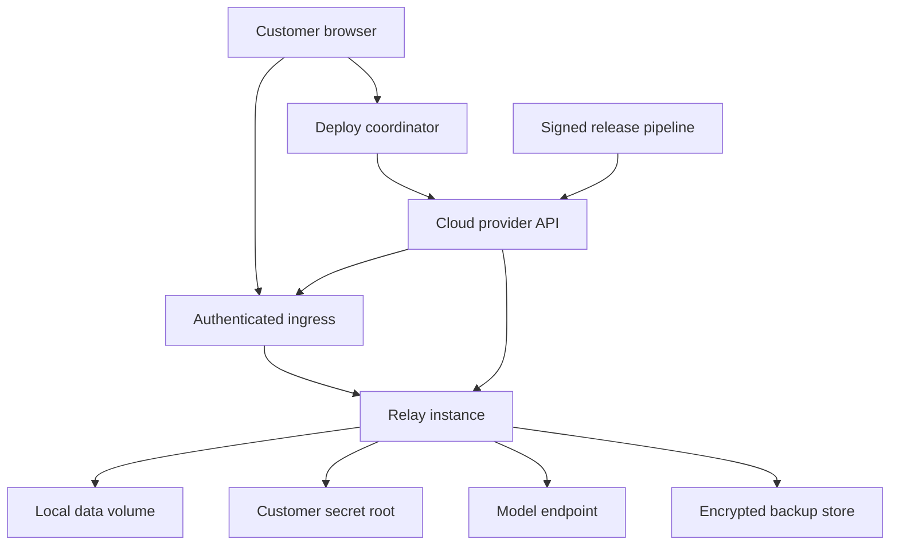

# G-078 licensed cloud deployment threat model

## Executive summary

Relay's highest cloud-deployment risks are exposing its currently auth-light
administrative API to the internet, mishandling customer cloud/model credentials,
and reporting partially provisioned or unrecoverable infrastructure as ready.
The proposed sealed customer-owned instance limits cross-customer blast radius,
but it is safe only after remote identity, least-privilege authorization,
immutable artifacts, private runtime networking, encrypted off-host recovery and
idempotent lifecycle receipts are implemented and independently verified.

## Scope and assumptions

In scope:

- current Relay CLI/Next.js runtime and API routes;
- future provider authorization and deployment coordinator;
- per-customer process/container, SQLite volume, files, secrets and licensing;
- authenticated ingress, first-admin bootstrap and lifecycle actions;
- BYOK APIs and private Ollama/LM Studio/LiteLLM services;
- OCI provenance, backups, restore, export, upgrade and deletion;
- operational support evidence and optional content-free telemetry.

Out of scope:

- Orionfold-hosted managed Relay or retained customer cloud tokens;
- row-level multi-tenancy in Relay Core;
- formal compliance certification or regulated-data claims;
- provider-internal vulnerabilities outside documented customer controls;
- CI/developer threats except where they affect published artifacts.

Validated assumptions from the operator on 2026-07-15:

- customers own provider accounts, billing, resources, data and long-lived keys;
- one instance serves one customer organization;
- cloud Relay is internet reachable only through authenticated ingress;
- v1 protects ordinary confidential business data;
- Orionfold receives no customer content telemetry;
- v1 uses local SQLite/WAL plus customer-owned encrypted off-host recovery.

Open questions that would change ranking:

- A future managed control plane retaining provider credentials creates a
  critical cross-customer credential and availability boundary.
- SSO, multiple roles, regulated data, residency or compliance commitments raise
  identity, audit, key-management and data-processing requirements.
- A packed multi-customer host elevates container escape, noisy-neighbor and
  fleet-operator compromise risks over the v1 one-instance proof.

## System model

### Primary components

- **Customer browser:** configures and operates the deployed Relay instance.
- **Deploy coordinator:** future local/product component that validates
  entitlement, creates topology plans, uses short-lived provider authority,
  reconciles lifecycle states and stores redacted receipts. It does not exist.
- **Cloud provider API:** creates networking, compute, volume, secrets, hostname,
  backup and optional runtime resources in the customer account.
- **Ingress/identity boundary:** future TLS, first-admin, session, authorization,
  CSRF, recovery and rate-limit layer. Current Relay lacks this cloud boundary.
- **Relay process:** Next.js app/API routes, startup services, scheduler, channels,
  backups, task engine and runtime adapters.
- **Instance data:** SQLite/WAL and files under `RELAY_DATA_DIR`.
- **Secret root:** current local `.keyfile` or future customer cloud KMS/secret
  manager references.
- **Model endpoint:** BYOK external API, private provider runtime or later hybrid
  tunnel.
- **Backup store:** customer-owned storage for encrypted versioned recovery.
- **Release supply chain:** current npm inputs plus future signed OCI artifact,
  manifest, digest, SBOM and schema metadata.

### Data flows and trust boundaries

- Internet → Ingress/identity: credentials, cookies and UI/API requests cross
  HTTPS. V1 requires TLS, secure sessions, authorization, origin/CSRF checks and
  rate limits. Current non-loopback Relay has none of these application controls;
  `bin/cli.ts` warns that no network authentication exists.
- Ingress/identity → Relay process: authenticated identity, organization binding
  and requests cross loopback/private HTTP. Relay must trust assertions only from
  configured ingress; arbitrary forwarded headers are untrusted.
- Browser → Deploy coordinator: topology choices and entitlement evidence cross
  an authenticated session. Versioned Zod schemas and a plan digest are required;
  provider secrets must never return to the browser.
- Deploy coordinator → Cloud provider API: a short-lived least-privilege token and
  manifests cross HTTPS. Redirect, scope, response schema, timeout, idempotency
  and receipt controls are required; no provider adapter exists yet.
- Relay process → SQLite/files: business data, prompts, outputs, documents,
  settings and execution state cross local filesystem and synchronous SQLite.
  `src/lib/db/index.ts` enables WAL/foreign keys; roots are defined in
  `src/lib/config/env.ts` and `src/lib/utils/ainative-paths.ts`.
- Relay process → Secret root: model/provider credentials and encryption keys
  cross local file APIs or a future secret API. `src/lib/utils/crypto.ts` uses
  AES-256-GCM and a mode-0600 keyfile, but has no cloud recovery contract.
- Relay process → Model endpoint: prompts, tool results, credentials and responses
  cross HTTP(S). `src/lib/agents/runtime/provider-endpoint.ts` validates URLs,
  blocks unconsented remote HTTP, refuses redirects and bounds errors/timeouts;
  DNS pinning/general SSRF defenses remain open.
- Relay process → Backup store: DB/files/settings, manifests, hashes and encryption
  metadata cross provider SDK/HTTPS. `src/lib/snapshots/*` only creates local
  artifacts today; off-host key and restore semantics are future work.
- Release pipeline → Customer provider: OCI layers, digest, manifest and SBOM
  cross a registry. Current npm distribution has no OCI provenance contract;
  mutable tags cannot be authoritative.
- Relay process → Orionfold/support: current license verification is offline using
  embedded public keys. Support evidence is customer-exported and redacted; no
  prompts, documents, model responses or other customer content may flow here.

#### Diagram

## Assets and security objectives

| Asset | Why it matters | Security objective (C/I/A) |
|---|---|---|
| Prompts, documents, tables and outputs | Disclosure reveals customer business data; tampering can alter autonomous actions | C, I |
| SQLite database and instance files | Contains nearly all per-instance operational state; loss stops the customer | C, I, A |
| Model/API credentials | Theft can expose data and create direct provider charges | C, I |
| Cloud provider authorization | Can create, change or delete customer infrastructure and billable resources | C, I, A |
| Admin identity, session and recovery | Takeover grants broad Relay read/mutation authority | C, I, A |
| Entitlement evidence | Bypass loses revenue; over-enforcement can strand customer operations | I, A |
| Topology manifest and lifecycle receipts | Tampering can redirect resources, hide cost or break rescue | I, A |
| OCI artifact and release metadata | Compromise gives code execution in every deployed instance | I, A |
| Backup ciphertext, keys and manifest | Exposure leaks all data; loss/tampering makes recovery impossible | C, I, A |
| Runtime endpoint policy | Misrouting can send prompts/keys to attacker infrastructure | C, I |
| Provider budget and capacity | Retry or compute abuse can cause denial of wallet/service | I, A |

## Attacker model

### Capabilities

- Send unauthenticated internet requests and enumerate common Next.js/API paths.
- Attempt credential stuffing, CSRF, session theft and first-admin races.
- Control a URL entered by a compromised or malicious administrator and return
  redirects, malformed data, slow responses or DNS changes.
- Steal a browser session or an accidentally logged provider/runtime token.
- Tamper with a mutable image tag or compromise an upstream publish dependency.
- Amplify cost through repeated deploy, task, runtime or GPU actions.
- Read a mistakenly public backup, log, receipt or runtime endpoint.

### Non-capabilities

- No assumed root/shell access to the customer's provider account or Relay host.
- No assumed compromise of cloud-provider KMS, TLS or identity internals.
- No shared cross-customer database or Orionfold control plane exists in v1.
- No legitimate access to private endpoints unless an admin configures one.
- No regulated-data scope beyond ordinary confidential business data.

## Entry points and attack surfaces

| Surface | How reached | Trust boundary | Notes | Evidence (repo path / symbol) |
|---|---|---|---|---|
| Relay listener/UI | Public hostname through future ingress | Internet → identity → Relay | Default loopback is safe; public bind is currently auth-light | `bin/cli.ts` host parsing and network-auth warning |
| API routes | Browser/direct HTTP | Identity → Next.js route | Many read/mutation routes need generated authorization classification | `src/app/api/` |
| First-admin flow | Deployment handoff link/exchange | Provider/bootstrap → Relay identity | Future single-use privileged path | No current implementation; planned G-081 |
| Deploy/lifecycle API | Licensed UI or direct request | Browser → deploy coordinator | Future paid, billable, destructive mutations | No current implementation; planned G-083 |
| Provider callback/API | OAuth/device/token and HTTPS API | Coordinator → provider | Future scopes, state/nonce, idempotency and token custody | No current implementation; planned G-083/G-085/G-086 |
| Local database/files | Relay process local I/O | Process → data volume | Single-host WAL and broad instance content | `src/lib/db/index.ts`; `src/lib/config/env.ts`; `src/lib/utils/ainative-paths.ts` |
| Snapshot/restore | Scheduler/UI/API | Relay → local/off-host recovery | Current restore is destructive and restart-bound | `src/lib/snapshots/snapshot-manager.ts`; `auto-backup.ts` |
| Secret storage | Settings/runtime/deploy configuration | Relay → secret root | Local keyfile today; cloud KMS/reference later | `src/lib/utils/crypto.ts`; `src/lib/licensing/store.ts` |
| Model endpoints | Configured HTTP(S) URLs | Relay → external/private network | SSRF and credential-forwarding boundary | `src/lib/agents/runtime/provider-endpoint.ts`; `src/lib/agents/runtime/` |
| License files | Local file/CLI installation | Relay → offline trust root | Existing signed term/entitlement gate | `src/lib/licensing/verify.ts`; `gate.ts`; `store.ts` |
| Release artifact | npm/registry/future OCI pull | Build identity → customer provider | OCI digest/signature/SBOM do not exist yet | `package.json`; `.github/workflows/` |
| Support evidence | Explicit customer export | Relay → operator/Orionfold | Must exclude content and secrets | local logs/diagnostics; future redacted receipt schema |

## Top abuse paths

1. **Take over public Relay:** discover hostname → call an unprotected mutation
   route → change model/settings or execute tasks → read/exfiltrate customer data.
2. **Win first-admin race:** obtain bootstrap value from URL/log/provider variable
   → redeem before customer → establish persistent admin session → lock out owner.
3. **Steal cloud authority:** induce over-scoped token or find it in a receipt/log
   → mutate unrelated customer resources → exfiltrate data or create charges.
4. **Cause duplicate billing:** replay Deploy or exploit retry ambiguity → create
   duplicate compute/volumes → leave partial state → repeat until budget exhausted.
5. **Pivot through model URL:** configure attacker/DNS-rebinding endpoint → Relay
   connects with credentials or to cloud metadata → steal tokens/data and pivot.
6. **Expose model runtime:** publish an unauthenticated Ollama/runtime port → invoke
   models/read metadata → consume GPU or access gateway data/keys.
7. **Defeat recovery:** make backup public or tamper ciphertext/manifest, or ensure
   key lives only on lost volume → leak all data or prevent restore after failure.
8. **Compromise release:** replace mutable tag/dependency → customer deploys altered
   artifact → malicious code reads data, model keys and provider credentials.
9. **Weaponize lifecycle:** steal session → delete/replace/upgrade without valid
   recovery point → corrupt volume or prevent rollback.
10. **Cross instance boundary:** attach wrong volume/secret/log/shared-runtime key
    on a future packed host → one customer reads another customer's content.

## Threat model table

| Threat ID | Threat source | Prerequisites | Threat action | Impact | Impacted assets | Existing controls (evidence) | Gaps | Recommended mitigations | Detection ideas | Likelihood | Impact severity | Priority |
|---|---|---|---|---|---|---|---|---|---|---|---|---|
| TM-001 | Remote unauthenticated attacker | Current Relay is internet exposed | Call UI/API routes without application identity and gain administrative capability | Full instance takeover and data/tool abuse | Customer data, admin state, credentials, availability | Loopback default and warning (`bin/cli.ts`) | No app auth/session/authorization/CSRF/rate limit | Block cloud/public readiness until G-081; authenticate and authorize every critical route; fail closed | Rejected-request reason codes, bootstrap/login alerts, CI route inventory | High | High | critical |
| TM-002 | Remote attacker or provider-log reader | Bootstrap secret is reusable, long-lived or logged | Race/replay first-admin creation | Persistent admin takeover | Admin identity/session, customer data | None; feature does not exist | No bootstrap contract | Single-use high-entropy short expiry, atomic consumption, no URL/log/storage token, explicit recovery | Bootstrap attempt/race/expiry receipts and customer-visible first-admin event | Medium | High | high |
| TM-003 | Token thief or malicious dependency | Customer grants broad or retained cloud token | Read token then mutate resources outside Relay deployment | Account compromise, data loss and charges | Provider authority, bill, infrastructure | Runtime settings redact some secrets | No cloud scope/custody implementation | OAuth/device flow, minimum scopes, short local custody, reference-only storage, discard/revoke and adapter scope tests | Authorization/revoke receipts, scope-drift alerts, secret-pattern scans | Medium | High | high |
| TM-004 | Remote attacker, flaky client or provider error | Deploy calls are replayable/non-atomic | Create duplicate/partial resources and conceal ongoing charges | Denial of wallet, orphan exposure, failed service | Bill, capacity, receipts | No cloud implementation | No plan digest, idempotency or reconciliation | Hashed plan, step idempotency, durable receipts, explicit partial states, cost cap, resume/rollback and final inventory | Duplicate digest, aged partial state, resource/budget delta and post-delete scans | Medium | High | high |
| TM-005 | Malicious admin or controlled endpoint | Attacker can influence configured provider/runtime URL or DNS | Capture credentials/prompts or reach metadata/internal services | Secret/data theft and infrastructure pivot | Model keys, prompts, provider metadata | URL/scheme/credential checks, consent, redirect refusal, timeout/redaction (`provider-endpoint.ts`) | DNS rebinding, metadata/link-local and general egress policy | Resolve-and-connect address policy, revalidation, metadata deny, egress proxy/allow profile, service auth | Destination class/resolution changes, blocked-address reason codes, content-free egress alerts | Medium | High | high |
| TM-006 | Internet attacker | Template exposes Ollama/LM Studio/LiteLLM port | Invoke runtime or access gateway metadata/keys | GPU cost, outage, possible data exposure | Runtime budget, keys, availability | Runtime endpoint configuration exists | No cloud network manifest/conformance | Private network, provider firewall, service credential/mTLS/gateway and unauthenticated probe | Public-port inventory and runtime cost/request anomalies | Medium | High | high |
| TM-007 | Storage attacker or operational failure | Backup is public/plaintext/tampered or key is lost with volume | Read all data or prevent recovery | Confidentiality breach or total data loss | Customer data, backup keys, availability | SQLite backup/manifest and local AES-GCM keyfile (`snapshot-manager.ts`, `crypto.ts`) | No off-host transport, recoverable key or restore drill | Customer-owned encrypted versioned store, integrity signing, recoverable envelope/KMS, least privilege, retention and isolated restore | Backup age/integrity/key/public-policy checks and restore receipts | Medium | High | high |
| TM-008 | Supply-chain attacker | Mutable tag/publish account/dependency is compromised | Substitute deployment artifact | Code execution in all deployed instances | All data, secrets, integrity | Existing npm/release process | No OCI digest/signature/SBOM contract | Digest pinning, signature/provenance/SBOM, protected build identity, staged rollout and known-good rollback | Digest hard failure, signature audit and deployed-version inventory | Low-Medium | High | high |
| TM-009 | License bypasser or faulty enforcement | Lifecycle route omits server gate or lapse policy conflates automation/data | Provision without entitlement or block/delete export/recovery | Revenue loss or customer data hostage | Entitlement, customer data, trust | Ed25519 verification and named gate (`verify.ts`, `gate.ts`) | No cloud entitlement/lapse route matrix | Dedicated gate on every mutation; synthetic term states; always allow export/recovery/manual ownership | Entitlement reason metrics and generated route parity | Medium | High | high |
| TM-010 | Misconfiguration or compromised fleet operator | Future host/runtime is shared across customers | Attach wrong volume/secret/log/key or weaken isolation | Cross-customer data breach | Customer data, secrets, logs | `RELAY_DATA_DIR`; G-058/G-060 process isolation | No packed-host/shared-runtime conformance | Separate identities/volumes/env/logs; per-instance keys/quotas; two-customer negative suite | Ownership labels, canaries, attachment-policy and support-bundle scans | Low in v1; Medium when packed | High | medium now; high when trigger fires |
| TM-011 | Stolen admin session or faulty upgrade/delete | Destructive action lacks step-up, snapshot or compatibility check | Delete/replace/migrate data without safe rollback | Data corruption/loss and outage | Database/files, backups, availability | Local snapshot exists; restore is explicit (`snapshot-manager.ts`) | No cloud lifecycle diff/reauth/rollback contract | Reauthentication, exact resource diff, pre-action verified recovery, schema compatibility, quiescence and remaining-resource receipt | Lifecycle audit, snapshot validation, migration reason codes and final inventory | Medium | High | high |
| TM-012 | Authenticated attacker or retry loop | Access to tasks/runtime/lifecycle with weak quotas | Trigger costly tasks/GPU/autoscale/retries | Denial of wallet and availability | Bill, runtime capacity, task service | Existing product budget/approval concepts | No cloud resource budget/reconciliation | Provider spending cap, per-instance/task/runtime quotas, bounded retries, GPU off/delete policy, emergency stop preserving data | Spend/concurrency/retry-rate alerts without content | Medium | Medium-High | high |

## Criticality calibration

- **Critical:** realistic remote path to complete instance or cross-customer
  compromise with little/no prior authorization. Examples: current auth-light
  Relay exposed to the internet; a future shared control-plane key granting every
  customer account; malicious signed artifact accepted across the fleet.
- **High:** requires a configured feature, stolen session/token or multi-step path
  but causes full customer data loss/disclosure, provider-account misuse or major
  cost. Examples: provider token leakage; unrecoverable/public backup; destructive
  upgrade without rollback.
- **Medium:** blast radius is bounded, prerequisites are privileged/uncommon or
  current v1 architecture removes the path. Examples: cross-customer leakage that
  only exists after host packing; short runtime outage; stale estimate without a
  provider mutation.
- **Low:** limited information/availability impact with strong prerequisites and
  straightforward recovery. Examples: rejected malformed provider metadata;
  content-free health detail disclosure; a stale read-only comparison clearly
  labeled non-current.

## Focus paths for security review

| Path | Why it matters | Related Threat IDs |
|---|---|---|
| `bin/cli.ts` | Defines listener binding, public warning, environment and shutdown | TM-001, TM-011 |
| `src/app/api/` | Every public read/mutation needs identity, authorization and CSRF classification | TM-001, TM-009, TM-011, TM-012 |
| `src/instrumentation-node.ts` | Starts privileged background services and owns process ordering | TM-004, TM-011, TM-012 |
| `src/lib/config/env.ts` | Defines canonical data and instance-mode roots | TM-007, TM-010 |
| `src/lib/utils/ainative-paths.ts` | Maps sensitive DB/file/artifact locations | TM-007, TM-010 |
| `src/lib/db/index.ts` | Owns SQLite/WAL connection and migration/bootstrap behavior | TM-007, TM-011 |
| `src/lib/snapshots/snapshot-manager.ts` | Owns consistency, destructive restore and recovery manifest | TM-007, TM-011 |
| `src/lib/snapshots/auto-backup.ts` | Owns scheduling, locking and failure visibility | TM-004, TM-007 |
| `src/lib/utils/crypto.ts` | Current encryption and local key root | TM-003, TM-007 |
| `src/lib/licensing/verify.ts` | Signed term/entitlement trust boundary | TM-009 |
| `src/lib/licensing/gate.ts` | Named server entitlement pattern | TM-009 |
| `src/lib/licensing/store.ts` | License file permissions and offline lifecycle | TM-009 |
| `src/lib/agents/runtime/provider-endpoint.ts` | SSRF-adjacent URL, redirect and secret controls | TM-005, TM-006 |
| `src/lib/agents/runtime/` | Model identity, credentials, discovery and routing | TM-005, TM-006, TM-012 |
| `src/lib/workflows/engine.ts` | Autonomous execution and runtime/module-load boundary | TM-005, TM-012 |
| `src/lib/instance/` | Existing bootstrap/upgrade/handoff authority to reuse carefully | TM-002, TM-004, TM-011 |
| `.github/workflows/` | Future OCI build identity and provenance boundary | TM-008 |
| `package.json` | Build/release commands and native runtime dependencies | TM-008 |

Quality check:

- Covered CLI, browser, API, provider, runtime, data, backup and release entry
  points; represented every trust boundary in flows and threats; separated runtime,
  future coordinator and release/CI; incorporated all operator clarifications;
  marked context changes that would alter risk; used repository evidence anchors;
  and excluded secrets and customer-content telemetry.
